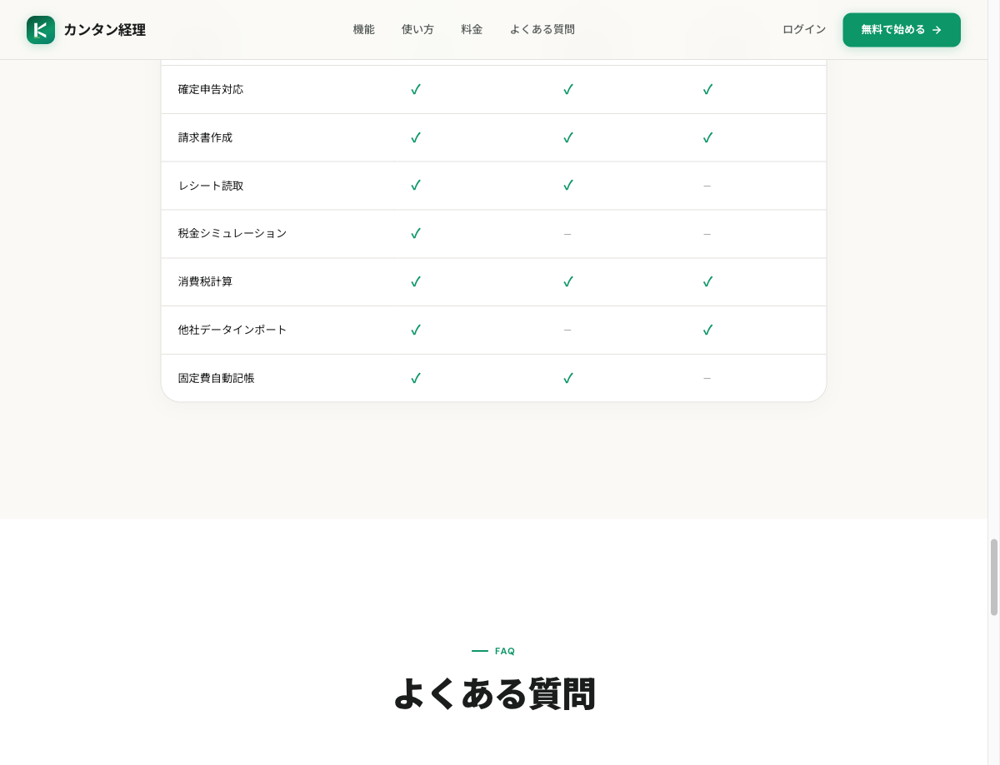
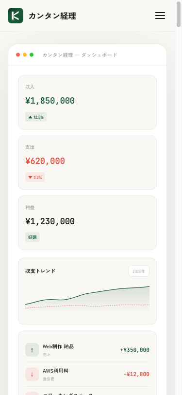
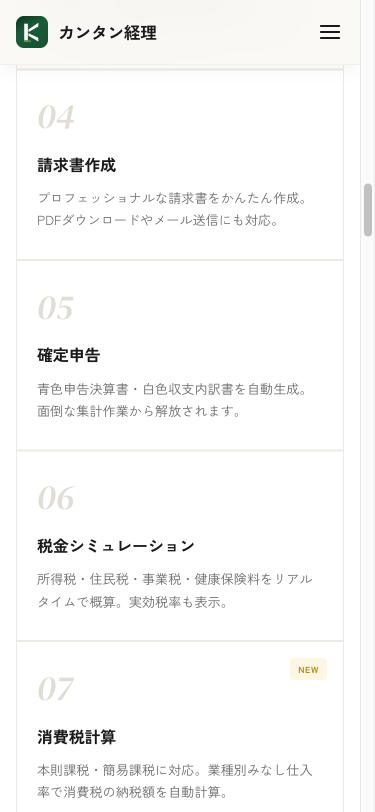

# keiri - カンタン経理

> 個人事業主向けのシンプルで使いやすい経理ソフト。
> 売上・経費・レシート管理から確定申告データの出力まで対応。



## ✨ 主な機能

- **売上・経費の入力**（PC / スマホ両対応・レスポンシブUI）
- **レシート画像の一元管理**（AWS S3 連携）
- **勘定科目マスタの自由カスタマイズ**
- **見積書・請求書の作成・PDF出力**（メール送信対応）
- **月次・年次レポート出力**
- **確定申告用データの出力**（青色申告対応）
- **取引先・顧客の管理**
- **複数事業者の切り替え**（マルチテナント）
- **Stripe による課金管理**

## 🛠️ 技術スタック

### フロントエンド

- **React 19** + **TypeScript**
- **Vite** + **Tailwind CSS 4**
- **Wouter**（軽量ルーター）
- **Radix UI** + **shadcn/ui**（コンポーネント）
- **React Hook Form** + **Zod**（フォーム & バリデーション）
- **TanStack Query**（データフェッチ）
- **Recharts**（グラフ）

### バックエンド

- **Express** + **tRPC**（型安全な API）
- **Drizzle ORM** + **MySQL**
- **AWS S3**（レシート画像ストレージ）
- **Stripe**（決済）
- **Nodemailer**（メール送信）

### 開発・運用

- **Vitest**（テスト）
- **PM2**（プロセス管理）
- **Nginx**（リバースプロキシ）

## 📸 スクリーンショット

|  デスクトップ  |  スマホ（ホーム）  |  スマホ（レシート）  |
|---|---|---|
|  |  |  |

## 🚀 セットアップ

```bash
# 依存関係のインストール
pnpm install

# 環境変数の設定
cp .env.example .env
# .env を編集（DB接続、AWS S3、Stripeキー等）

# DB マイグレーション
pnpm db:push

# 開発サーバ起動
pnpm dev
```

ブラウザで `http://localhost:5173` を開いて確認。

## 🧪 テスト

```bash
pnpm test
```

## 📦 ビルド & デプロイ

```bash
pnpm build      # フロント + サーバを dist/ にビルド
pnpm start      # 本番起動（NODE_ENV=production）
```

## 🌐 運用

このツールは Cotton-Web で本番運用中です：
**https://sns-tool.online/keiri/**

「使う側」の感覚を持つために自社で開発・運用しており、
「実際に毎日使う側が何にストレスを感じるか」を反映した UX を磨いています。

## 📝 ライセンス

MIT License

## 👤 作者

**Cotton-Web（山田 英紀 / Hi）**

業務システム制作 × SNS自動化 × AI連携 を一人で完結するエンジニアです。

- 自社サイト: [https://sns-tool.online](https://sns-tool.online)
- 連絡先: yamada@sns-tool.online

### 他の自社開発プロダクト

- [posutto](https://sns-tool.online/posutto/) - マルチSNS自動投稿ツール
- [tubetto](https://sns-tool.online/tubetto/) - YouTube動画自動生成・公開ツール
- [tradepostpro](https://sns-tool.online/tradepostpro/) - FX実績連動マルチSNS投稿

---

業務システム制作・AI連携プロダクト開発のご相談は yamada@sns-tool.online までお気軽にどうぞ。
